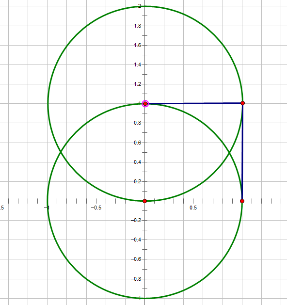
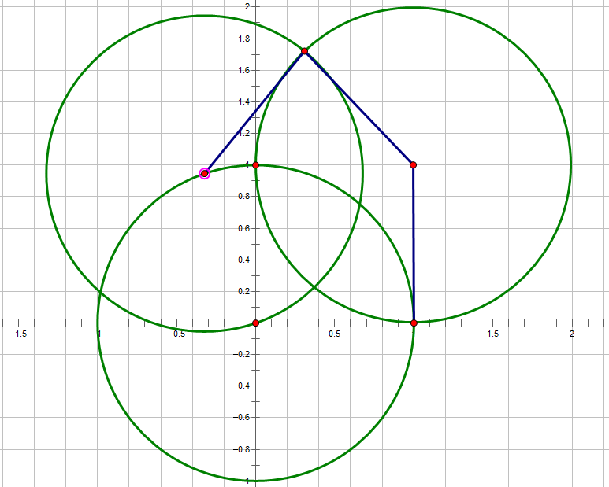
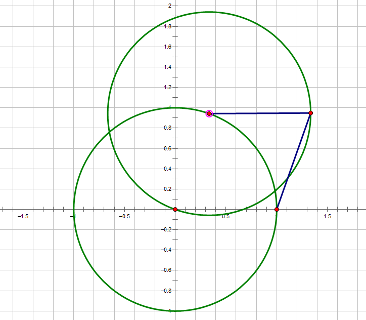
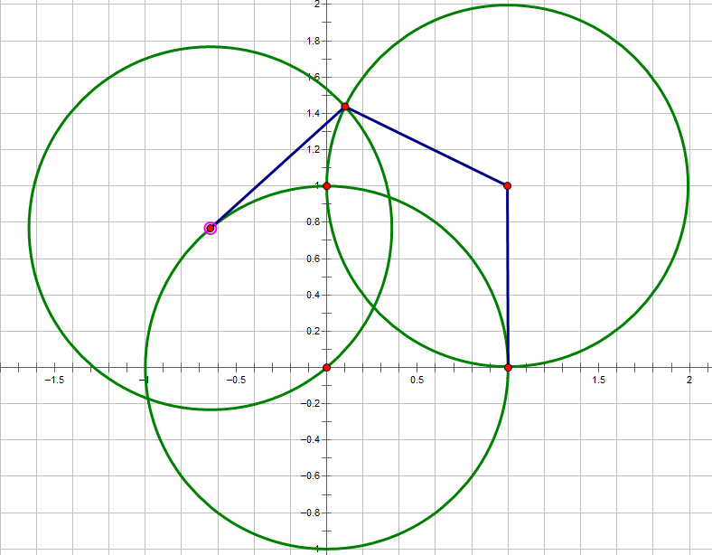
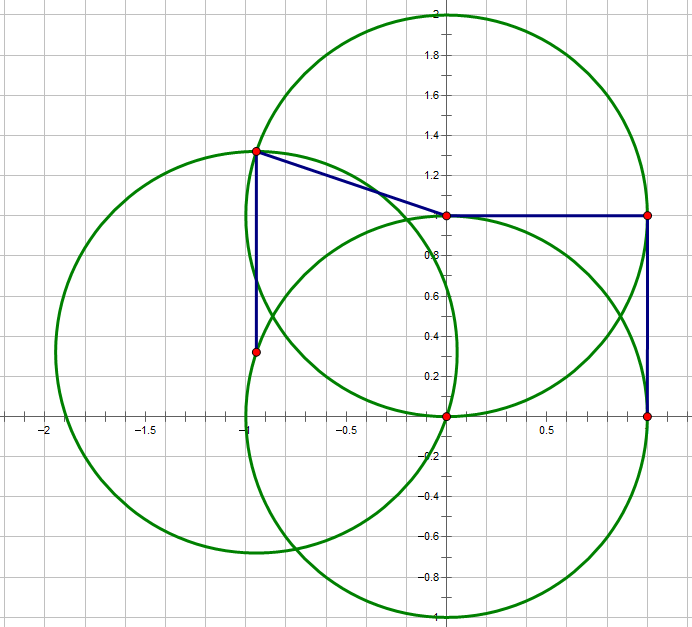

## G. Easy Glide

经过给定的点时速度从v1变成v2，维持3s变回v1，把起点，终点和给定点连起来，就是一个最短路问题，朴素迪杰斯特拉或者堆优化都可以。

## M. BpbBppbpBB

统计形如

```
######
##..##
#....#
#....#
##..##
######
```
的数量即可，也可以比较两个之间的距离判断（我比赛时这么写的...）

## I. Barbecue

操作的时候如果不是回文字符串，并且长度大于2，那么总是可以操作使字符串不变成回文串

所以只需要判断字符串是不是回文，如果不是判断字符串的长度的奇偶。

判断子字符串是否是回文，可以用hash，也可以用Manacher(我比赛时用了这个，用起来比hash烦)

## J. Frog

看图

### 圆心角90度



### 圆心角约等于131度



### 可得出结论：
设圆心角为θ，
 - θ=0，最少0步，
 - θ≤90，最少2步，如图所示：

 - 90<θ≤131，最少3步，如图所示：

 - 131<θ≤180，最少4步，如图所示：

 - θ>180，与(360-θ)的步数相同，走法相反。

